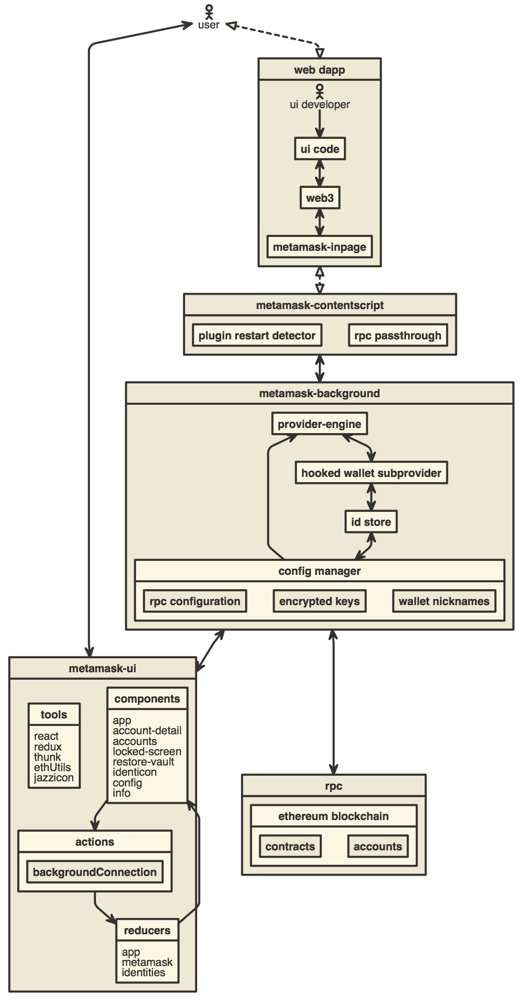

# SigmaMask

This is a fork of MetaMask for test purposes. Do not use in production.

## Building on your local machine

- Install [Node.js](https://nodejs.org) version 20
  - If you are using [nvm](https://github.com/nvm-sh/nvm#installing-and-updating) (recommended) running `nvm use` will automatically choose the right node version for you.
- Enable Corepack by executing the command `corepack enable` within the metamask-extension project. Corepack is a utility included with Node.js by default. It manages Yarn on a per-project basis, using the version specified by the `packageManager` property in the project's package.json file. Please note that modern releases of [Yarn](https://yarnpkg.com/getting-started/install) are not intended to be installed globally or via npm.
- Duplicate `.metamaskrc.dist` within the root and rename it to `.metamaskrc` by running `cp .metamaskrc{.dist,}`.
  - If debugging MetaMetrics, you'll need to add a value for `SEGMENT_WRITE_KEY` [Segment write key](https://segment.com/docs/connections/find-writekey/), see [Developing on MetaMask - Segment](./development/README.md#segment).
  - If debugging unhandled exceptions, you'll need to add a value for `SENTRY_DSN` [Sentry Dsn](https://docs.sentry.io/product/sentry-basics/dsn-explainer/), see [Developing on MetaMask - Sentry](./development/README.md#sentry).
  - Optionally, replace the `PASSWORD` value with your development wallet password to avoid entering it each time you open the app.
- Make sure to have **SigmaMaskCore** already built in `../SigmaMaskCore`.
- Run `yarn install` to install the dependencies.
- Build the project to the `./dist/` folder with `yarn dist`.

  - Optionally, you may run `yarn start` to run dev mode.
  - Uncompressed builds can be found in `/dist`, compressed builds can be found in `/builds` once they're built.
  - See the [build system readme](./development/build/README.md) for build system usage information.

- Follow these instructions to verify that your local build runs correctly:
  - [How to add custom build to Chrome](./docs/add-to-chrome.md)
  - [How to add custom build to Firefox](./docs/add-to-firefox.md)

## Contributing

### Development builds

To start a development build (e.g. with logging and file watching) run `yarn start`.

#### React and Redux DevTools

To start the [React DevTools](https://github.com/facebook/react-devtools), run `yarn devtools:react` with a development build installed in a browser. This will open in a separate window; no browser extension is required.

To start the [Redux DevTools Extension](https://github.com/reduxjs/redux-devtools/tree/main/extension):

- Install the package `remotedev-server` globally (e.g. `yarn global add remotedev-server`)
- Install the Redux Devtools extension.
- Open the Redux DevTools extension and check the "Use custom (local) server" checkbox in the Remote DevTools Settings, using the default server configuration (host `localhost`, port `8000`, secure connection checkbox unchecked).

Then run the command `yarn devtools:redux` with a development build installed in a browser. This will enable you to use the Redux DevTools extension to inspect MetaMask.

To create a development build and run both of these tools simultaneously, run `yarn start:dev`.

### Changing dependencies

Whenever you change dependencies (adding, removing, or updating, either in `package.json` or `yarn.lock`), there are various files that must be kept up-to-date.

- `yarn.lock`:
  - Run `yarn` again after your changes to ensure `yarn.lock` has been properly updated.
  - Run `yarn lint:lockfile:dedupe:fix` to remove duplicate dependencies from the lockfile.
- The `allow-scripts` configuration in `package.json`
  - Run `yarn allow-scripts auto` to update the `allow-scripts` configuration automatically. This config determines whether the package's install/postinstall scripts are allowed to run. Review each new package to determine whether the install script needs to run or not, testing if necessary.
  - Unfortunately, `yarn allow-scripts auto` will behave inconsistently on different platforms. macOS and Windows users may see extraneous changes relating to optional dependencies.
- The LavaMoat policy files
  - If you are a MetaMask team member and your PR is on a repository branch, you can use the bot command `@metamaskbot update-policies` to ask the MetaMask bot to automatically update the policies for you.
  - If your PR is from a fork, you can ask a MetaMask team member to help with updating the policy files.
  - Manual update instructions: The _tl;dr_ is to run `yarn lavamoat:auto` to update these files, but there can be devils in the details:
    - There are two sets of LavaMoat policy files:
      - The production LavaMoat policy files (`lavamoat/browserify/*/policy.json`), which are re-generated using `yarn lavamoat:webapp:auto`. Add `--help` for usage.
        - These should be regenerated whenever the production dependencies for the webapp change.
      - The build system LavaMoat policy file (`lavamoat/build-system/policy.json`), which is re-generated using `yarn lavamoat:build:auto`.
        - This should be regenerated whenever the dependencies used by the build system itself change.
    - Whenever you regenerate a policy file, review the changes to determine whether the access granted to each package seems appropriate.
    - Unfortunately, `yarn lavamoat:auto` will behave inconsistently on different platforms.
      macOS and Windows users may see extraneous changes relating to optional dependencies.
    - If you keep getting policy failures even after regenerating the policy files, try regenerating the policies after a clean install by doing:
      - `rm -rf node_modules/ && yarn && yarn lavamoat:auto`
    - Keep in mind that any kind of dynamic import or dynamic use of globals may elude LavaMoat's static analysis.
      Refer to the LavaMoat documentation or ask for help if you run into any issues.

## Architecture

- [Visual of the controller hierarchy and dependencies as of summer 2022.](https://gist.github.com/rekmarks/8dba6306695dcd44967cce4b6a94ae33)
- [Visual of the entire codebase.](https://mango-dune-07a8b7110.1.azurestaticapps.net/?repo=metamask%2Fmetamask-extension)

[][1]

## Other Docs

- [How to add a new translation to MetaMask](./docs/translating-guide.md)
- [Publishing Guide](./docs/publishing.md)
- [How to use the TREZOR emulator](./docs/trezor-emulator.md)
- [Developing on MetaMask](./development/README.md)
- [How to generate a visualization of this repository's development](./development/gource-viz.sh)
- [How to add new confirmations](./docs/confirmations.md)
- [Browser support guidelines](./docs/browser-support.md)

## Dapp Developer Resources

- [Extend MetaMask's features w/ MetaMask Snaps.](https://docs.metamask.io/snaps/)
- [Prompt your users to add and switch to a new network.](https://docs.metamask.io/wallet/how-to/add-network/)
- [Change the logo that appears when your dapp connects to MetaMask.](https://docs.metamask.io/wallet/how-to/display/icon/)

[1]: http://www.nomnoml.com/#view/%5B%3Cactor%3Euser%5D%0A%0A%5Bmetamask-ui%7C%0A%20%20%20%5Btools%7C%0A%20%20%20%20%20react%0A%20%20%20%20%20redux%0A%20%20%20%20%20thunk%0A%20%20%20%20%20ethUtils%0A%20%20%20%20%20jazzicon%0A%20%20%20%5D%0A%20%20%20%5Bcomponents%7C%0A%20%20%20%20%20app%0A%20%20%20%20%20account-detail%0A%20%20%20%20%20accounts%0A%20%20%20%20%20locked-screen%0A%20%20%20%20%20restore-vault%0A%20%20%20%20%20identicon%0A%20%20%20%20%20config%0A%20%20%20%20%20info%0A%20%20%20%5D%0A%20%20%20%5Breducers%7C%0A%20%20%20%20%20app%0A%20%20%20%20%20metamask%0A%20%20%20%20%20identities%0A%20%20%20%5D%0A%20%20%20%5Bactions%7C%0A%20%20%20%20%20%5BbackgroundConnection%5D%0A%20%20%20%5D%0A%20%20%20%5Bcomponents%5D%3A-%3E%5Bactions%5D%0A%20%20%20%5Bactions%5D%3A-%3E%5Breducers%5D%0A%20%20%20%5Breducers%5D%3A-%3E%5Bcomponents%5D%0A%5D%0A%0A%5Bweb%20dapp%7C%0A%20%20%5Bui%20code%5D%0A%20%20%5Bweb3%5D%0A%20%20%5Bmetamask-inpage%5D%0A%20%20%0A%20%20%5B%3Cactor%3Eui%20developer%5D%0A%20%20%5Bui%20developer%5D-%3E%5Bui%20code%5D%0A%20%20%5Bui%20code%5D%3C-%3E%5Bweb3%5D%0A%20%20%5Bweb3%5D%3C-%3E%5Bmetamask-inpage%5D%0A%5D%0A%0A%5Bmetamask-background%7C%0A%20%20%5Bprovider-engine%5D%0A%20%20%5Bhooked%20wallet%20subprovider%5D%0A%20%20%5Bid%20store%5D%0A%20%20%0A%20%20%5Bprovider-engine%5D%3C-%3E%5Bhooked%20wallet%20subprovider%5D%0A%20%20%5Bhooked%20wallet%20subprovider%5D%3C-%3E%5Bid%20store%5D%0A%20%20%5Bconfig%20manager%7C%0A%20%20%20%20%5Brpc%20configuration%5D%0A%20%20%20%20%5Bencrypted%20keys%5D%0A%20%20%20%20%5Bwallet%20nicknames%5D%0A%20%20%5D%0A%20%20%0A%20%20%5Bprovider-engine%5D%3C-%5Bconfig%20manager%5D%0A%20%20%5Bid%20store%5D%3C-%3E%5Bconfig%20manager%5D%0A%5D%0A%0A%5Buser%5D%3C-%3E%5Bmetamask-ui%5D%0A%0A%5Buser%5D%3C%3A--%3A%3E%5Bweb%20dapp%5D%0A%0A%5Bmetamask-contentscript%7C%0A%20%20%5Bplugin%20restart%20detector%5D%0A%20%20%5Brpc%20passthrough%5D%0A%5D%0A%0A%5Brpc%20%7C%0A%20%20%5Bethereum%20blockchain%20%7C%0A%20%20%20%20%5Bcontracts%5D%0A%20%20%20%20%5Baccounts%5D%0A%20%20%5D%0A%5D%0A%0A%5Bweb%20dapp%5D%3C%3A--%3A%3E%5Bmetamask-contentscript%5D%0A%5Bmetamask-contentscript%5D%3C-%3E%5Bmetamask-background%5D%0A%5Bmetamask-background%5D%3C-%3E%5Bmetamask-ui%5D%0A%5Bmetamask-background%5D%3C-%3E%5Brpc%5D%0A
